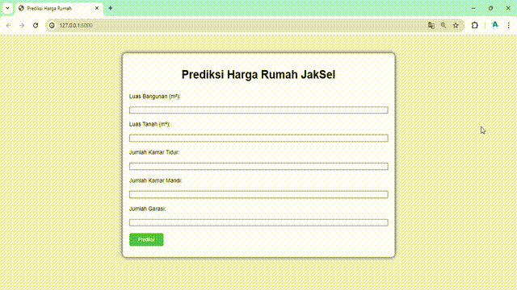
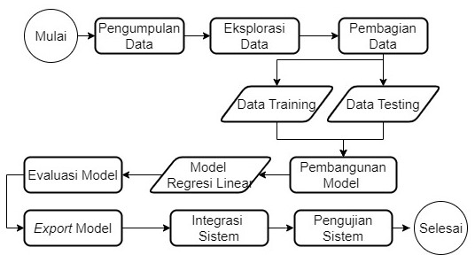

# Jakarta Selatan House Price Predictor
Jakarta Selatan House Price Prediction adalah proyek berbasis _machine learning_ yang bertujuan untuk memprediksi harga rumah di Jakarta Selatan menggunakan regresi linear. 
Dengan memanfaatkan data yang mencakup berbagai fitur properti, seperti luas bangunan, luas tanah, jumlah kamar tidur, jumlah kamar mandi, dan keberadaan garasi, model ini diharapkan dapat memberikan estimasi harga rumah yang akurat. Proyek ini akan membantu pembeli, penjual, dan agen properti dalam membuat keputusan yang lebih informasional dan berbasis data.

    <h2> Tabel konten </h2>
    <ul>
        <li>
            <a href="#Instalasi">Panduan Instalasi</a>
        </li>
        <li>
            <a href="#Penggunaan">Panduan Pengguaan</a>
        </li>
        <li>
            <a href="#Tahapan">Tahapan Pengerjaan</a>
        </li>
    </ul>

    <h2>
        <a href="#tabel-konten">Panduan Instalasi</a>
    </h2>

Hal yang perlu dipersiapkan:

1. Python versi 3.10 ke atas. [Cara Memasang Python](https://wiki.python.org/moin/BeginnersGuide/Download)
2. Library tambahan, pasang dengan cara mengetik perintah `pip install -r requirements.txt` di terminal di mana direktori file `requirements.txt` berada

    <h2>
        <a href="#tabel-konten">Panduan Penggunaan</a>
    </h2>

1. Buka terminal
2. Jalankan perintah `python app.py`
3. Jika aplikasi sudah ada tulisan _Running on http://127.0.0.1:5000_, buka browser dan akses `http://localhost:5000` atau `http://127.0.0.1:5000`
4. Akan ditampilkan halaman utama untuk website ini
5. Masukkan nilai untuk setiap komponen rumah
6. Setelah terisi semua, menekan tombol `prediksi`, maka akan ditampilkan harga prediksi rumah dari komponen yang telah diisi
6. Proses prediksi dapat dilakukan berulang kali untuk berbagai nilai pada setiap komponen rumah.
  

8. Untuk menghentikan program, kembali ke terminal dan tekan tombol `CTRL + C`

    <h2>
        <a href="#tabel-konten">Tahapan Pengerjaan</a>
    </h2>

Projek ini mempunyai tahapan pengerjaan sebagai berikut:

  

Pengerjaan projek dapat dilihat pada jupyter notebook [di sini](model/house_prediction.ipynb). 

### Pengumpulan Data
Pengumpulan data dilakukan dengan cara mengakses website [Kaggle](https://www.kaggle.com/datasets/wisnuanggara/daftar-harga-rumah/data). Data final yang digunakan pada projek ini dapat diakses [di sini](./data/dataset.csv).  